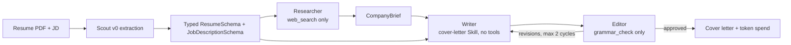

# Scout v2

Scout turns a resume and job description into a grounded cover-letter draft. It keeps
the original Gemini + Instructor extraction flow intact, then passes typed data through a
bounded Claude/LangGraph Researcher → Writer → Editor workflow.

## Install

```powershell
python -m venv .venv
.\.venv\Scripts\Activate.ps1
pip install -r requirements.txt
```

Set `GOOGLE_API_KEY` for the original `extract` command and `ANTHROPIC_API_KEY` for
`cover-letter`. Scout v2 also expects the sibling
[`claude-skills`](https://github.com/PranavMunigala/claude-skills) repository; override
its location with `SCOUT_COVER_LETTER_SKILL` when needed.

## Use

```powershell
python main.py cover-letter --resume examples/PranavResume28.pdf --jd examples/bdjobdesc.txt --company BD --out bd-cover-letter.md
```

The legacy extraction command remains available:

```powershell
python main.py extract --resume resume.pdf --jd job-description.txt --out analysis.json
```

## Pipeline



The supervisor owns routing and has an explicit `done` exit. Agent boundaries carry
Pydantic objects (`CompanyBrief`, `Revision`) rather than free-text research notes.

## Sample run

**Input:** A mid-level candidate with four years of Python, FastAPI, PostgreSQL, and
Docker experience applies to Northstar Health's backend role. The source-backed company
brief says it is simplifying care coordination and expanding clinician workflow tools.

**Output:**

> Dear Hiring Team,
>
> My four years of experience with Python, FastAPI, and PostgreSQL align directly with
> the backend requirements for Northstar Health. These technologies map to the role's
> Python, API design, and relational-database requirements.
>
> Northstar Health's focus on simplifying care coordination for clinics, alongside its
> clinician-facing workflow tools, gives that match a concrete context. My Python,
> FastAPI, PostgreSQL, and Docker background can support the backend work behind those
> services.
>
> I would welcome the opportunity to discuss how that experience could contribute to
> your backend team. Thank you for your consideration.

## Evaluation

[`evals/cover_letter/cases.json`](evals/cover_letter/cases.json) contains five varied
profile/JD/company-brief cases with quality checklists. The Skill is also runnable outside
Scout through `claude-skills/cover-letter/run_standalone.py`, making its standalone and
agent outputs directly comparable.

## Cost and specialization

A measured Claude Sonnet 5 Writer + Skill call for the Northstar sample used **887 input
tokens** and **1,024 output tokens** (including 672 adaptive-thinking tokens). At the
current introductory rate of $2 / million input tokens and $10 / million output tokens,
that request cost **$0.0120**. This is a measured Writer pass, not a full pipeline total;
the complete Researcher → Writer → Editor run logs its actual per-agent token usage and
enforces a 50,000-token cap. [Claude Sonnet 5 pricing](https://platform.claude.com/docs/en/about-claude/models/whats-new-sonnet-5)

Specialization buys accountable context. A single-agent draft can blend research, writing,
and editing into one opaque response. Scout isolates company research in a sourced
`CompanyBrief`, makes the Writer use the portable cover-letter Skill, and confines the
Editor to grammar checks and typed revisions. The trade-off is extra model calls and
token cost; the return is a letter whose company claims and candidate claims can be traced
to structured inputs rather than a generic prompt.
